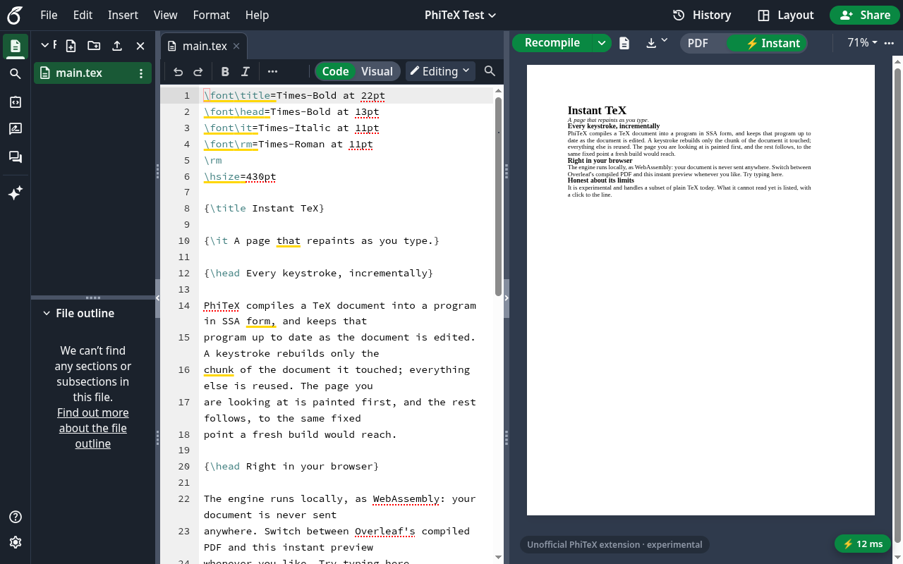

# PhiTeX Instant for Overleaf

**A live LaTeX preview that updates as you type: no Recompile, typically
milliseconds per keystroke. It runs entirely in your browser.**

> **Unofficial and experimental.** This extension is not made, endorsed or
> supported by Overleaf; "Overleaf" names the site it works with, nothing
> more. Overleaf's own PDF stays the real one: use ⚡ Instant to write, and
> Overleaf's Recompile for the PDF you submit.



## What it does

Overleaf compiles your whole project each time you press Recompile. PhiTeX
Instant keeps a compiled copy of your document in memory and, on every
keystroke, re-typesets only the part your edit affects. The page you are
looking at is repainted first.

- **⚡ Instant preview** in Overleaf's PDF pane, behind a **PDF | ⚡ Instant**
  switch next to Recompile (**Alt+Shift+P** toggles it).
- **Real LaTeX**: the engine is pdfTeX, run as WebAssembly, with TeX Live
  2026's packages and fonts. Your class files, `.bib` files and PDF/JPEG
  figures come from your project.
- **Selectable, searchable text**: pages are drawn as vector graphics with
  the fonts' real outlines. You can select and copy text and find it with
  Ctrl+F, and it stays sharp at any zoom.
- **Source ↔ page**: double-click the page to jump to that word in the
  editor (opening its file). Double-click in the editor, or on a heading in
  Overleaf's file outline, to highlight it on the page. A setting makes the
  yellow highlight follow your cursor or your selection instead.
- **Bibliographies, indexes and minted**: BibTeX and makeindex run inside
  the build, and re-run only for what changed. `minted` works too:
  latexminted and Pygments run as Python in WebAssembly, loaded only for a
  project that uses minted.
- **Diagnostics**: a badge counts errors and warnings. Click an entry to
  jump to its line. When an edit breaks the document (an unclosed `{`, say),
  the last good page stays on screen, dimmed, with the reason.
- **Download the ⚡ Instant PDF** from the download button in the PDF
  toolbar. The ▾ menu next to it still gives Overleaf's compiled PDF.
- **Follows Overleaf**: its light/dark theme, its toolbar layout, and its
  "dark mode PDF" setting.

## Install

From the Chrome Web Store, Microsoft Edge Add-ons or Firefox Add-ons
*(links coming with the public release)*. It works in Chrome, Edge, Brave
and other Chromium browsers, and in Firefox 128 or later.

Open any project on `https://www.overleaf.com/project/…`, switch the PDF
pane to **⚡ Instant**, and accept the short terms (unofficial,
experimental, as is) the first time.

### The first time you open a project

The extension ships with LaTeX's core. Other packages your document uses
(TikZ, fonts, a journal class's dependencies, …) are downloaded **once**,
the first time a project needs them, and then kept in your browser. A
loading card shows each step (packages, then typesetting), which files are
arriving, and how long it has been running. A large paper's first load can
take a few seconds to a minute on a slow connection. After that it opens
almost straight away and works offline.

## Settings

Click the extension's ⚡ icon in the browser toolbar:

| Setting | What it does |
| --- | --- |
| Enable on Overleaf | Off: Overleaf exactly as it is, immediately. |
| Opens with | Which view a project opens in: Overleaf's PDF or ⚡ Instant. |
| Page | Vector (selectable text) or PNG. |
| PDF highlight | When the yellow highlight shows on the page: following the cursor, the selection, or only on a double-click. |
| Engine | pdfLaTeX (XeLaTeX and LuaLaTeX: not yet). |
| Show the ⚡ ms chip | The small timer at the bottom of the pane that shows how fast each keystroke reached the page. |
| Package cache | How many TeX Live files are kept in this browser and their size. **Clear** removes them; they are downloaded again when next needed. |
| Tips / What's new | The welcome tip and release notes, on or off. |
| Withdraw consent / Reset extension | Reset wipes every setting, as if just installed. |

## Privacy

**Your documents never leave your browser.**

- The typesetter runs locally, as WebAssembly inside the extension, and so
  does Python for `minted`. No code is downloaded at run time.
- The extension reads your project from overleaf.com as you, the same way
  Overleaf's editor does. It never writes to Overleaf and never changes your
  documents.
- For a TeX package it doesn't bundle, it downloads that package from
  **Shelf** (`shelf-phitex.pages.dev`, static files on Cloudflare Pages)
  with a plain GET request such as `…/tl2026/h/pgf-3f9a2c41b0de.pack`. Which
  file holds which package is listed in an index inside the extension, so
  only package names are requested. At most once a day the extension also
  reads `…/tl2026/release.json` to learn of a newer index (new packages,
  fixes), which it then downloads. No document text, file name of yours, or
  identifier is sent.
  Cloudflare sees the request and your IP address, as with any website.
  Shelf keeps no logs of its own.
- No analytics, no accounts, no tracking. Settings are kept in the
  browser's extension storage, and downloaded packages in its IndexedDB.
  Your document content is kept in memory only while the tab is open.

The full policy is in [PRIVACY.md](PRIVACY.md).

Permissions:
- `offscreen` (Chrome, Edge): runs the typesetter in a background worker
  (in Firefox, the extension's background page does);
- `storage`: keeps the settings;
- `activeTab`: lets the settings popup start the tour in the open tab;
- access to `https://www.overleaf.com/project/*` only.

## Limits

It is experimental. When the ⚡ Instant page and Overleaf's PDF disagree,
Overleaf's is right.

- **pdfLaTeX only, for now**: projects that need XeLaTeX or LuaLaTeX
  (`fontspec`, `unicode-math`, `polyglossia`, …) can't be previewed yet. The
  card says so and offers pdfLaTeX anyway; Settings → Engine chooses for
  every project, the card for one.
- **Images**: PDF, PNG and JPEG figures work.
- **Shell escape** is restricted, as in TeX Live's `pdflatex`, and only
  `minted`'s command runs: packages that run other programs (`gnuplottex`,
  `svg`, `epstopdf` conversions) take their no-shell path. A minted code
  block takes a second or two to update; prose around it stays instant.
- **Some packages and fonts aren't fully supported yet.** One example is
  `microtype`'s font expansion (used by `acmart` and other classes). When the
  engine stops on something it can't do, the diagnostics name it.
- **Speed varies with what you edit.** Ordinary text and headings update in
  a few milliseconds. Editing a macro that a big TikZ picture uses on every
  point can take a second or more.
- **Bibliographies and cross-references** settle in the background, as
  `latexmk` would: BibTeX runs inside the build, and references update a
  moment after you stop typing. Only BibTeX and makeindex run (no biber or
  xindy).
- **Large documents** need memory and time on first open: a 64-page thesis
  shows its pages in about half a minute, and is ready for instant edits
  after a minute or two.
- **Source ↔ page** works for text. Figures and lines that come only from
  a macro (a section number, say) map to the macro's call.
- It depends on Overleaf's page structure, which is not a public API. If
  Overleaf changes it, the preview falls back to a floating window until
  the extension is updated.
- One project per tab.

## Troubleshooting

- **The preview is stuck on "Fetching packages"**: check your connection.
  The live line on the loading card says whether files are still arriving.
  A package that can't be fetched shows up in the diagnostics, and it is
  retried on the next attempt.
- **"Not found in TeX Live" in the diagnostics (info)**: LaTeX looks for
  many optional files (`*.cfg` and similar) that usually don't exist. This
  is normal. Only a file that stops the build is an error.
- **Something looks wrong after an update**: in the settings, use
  *Package cache → Clear*, then reload the Overleaf tab.
- **Download says "No complete PDF yet"**: the build stopped before the end
  of your document. Fix the error the diagnostics show, or download
  Overleaf's PDF from the ▾ menu.

To report a bug, open ⓘ diagnostics → **Report a problem…** (or click an
error). It shows an anonymized debug report: versions, timings, errors and
package names, with no document text, nothing you typed, and files named
`file1.tex`, …. Read it, then **Copy** it or **Email** it to
flinner@nand.sh. Nothing is sent unless you send it.

## Building from source

> The PhiTeX engine this extension embeds (accl-kaust/PhiTeX) is not public
> yet. Until it is, the extension can't be built from this repository alone.

With the engine checked out, you need the Rust toolchain pinned in
`rust-toolchain.toml` with the `wasm32-wasip1` target, Node ≥ 22, and
bubblewrap (for `scripts/sandbox`, which runs every build step without
network access or `$HOME`):

    scripts/sandbox --net npm ci --ignore-scripts   # TypeScript and @types/chrome (dev only)
    scripts/build.sh                                # wasm core, LaTeX format, TypeScript → extension/

Then go to `chrome://extensions`, turn on *Developer mode*, choose *Load
unpacked*, and pick `extension/`.

Development:

    scripts/build.sh --dev                          # also runs on the local mock
    scripts/sandbox --net node mock/server.mjs      # mock Overleaf at http://localhost:8123/project/mock
    scripts/chrome.sh [url]                         # Chromium with the extension, DevTools on :9222
    scripts/sandbox node --test test/               # TypeScript and wasm tests

Debug runs, scripted (no clicking through the terms, the tour or "Next":
both runners write the onboarded state first, `scripts/onboarded.mjs`, via
a content-script hook that listens on `localhost` only):

    scripts/sandbox --net node scripts/mock-run.mjs test/scenarios/sync.json   # Chromium, headless: steps, trace, screenshots → target/mock-run/<name>/
    PHITEX_RUN=1 scripts/sandbox --net node scripts/mock-run.mjs ...           # a second run beside the first (own ports and profile)
    scripts/package.sh && node scripts/fx-run.mjs                              # Firefox: the store package as a temporary add-on, on the mock

`mock-run.mjs` steps (see its header): `type`, `replace`, `idle`, `shot`,
`dblpage`, `dbltext`, `cursor`, `select`, `pagesel`, `eval` (`"page": true`
for the page's world), `trace` (the core's rebuild log in `core-log.txt`),
`pdfsave`, `auxdump`. `fx-run.mjs` prints the content script's trace and
errors when no page shows (Firefox's automation can't reach content
scripts).

The mock imitates the parts of Overleaf the extension reads: the CodeMirror
editor, the file tree, the project endpoints, and the split PDF pane. After
a change to the core, restart the browser (`scripts/chrome.sh`), because
the offscreen document keeps the loaded wasm across page reloads.

### How it works

```
Overleaf page                                            extension
  CodeMirror 6 ── hook.ts (page world): each transaction's changes
      └─ postMessage ─▶ content script: session.ts (editor-agnostic)
                          edits → UTF-8 byte ranges, merged, one build in flight
                        ── port ─▶ offscreen document ─▶ Worker: core.wasm
                                                            pdfTeX (partex), SSA rebuilds
                                                            missing files → Shelf
```

- **Pages**: a second worker draws pages from the PDF each build links,
  the page you read first, then the rest ahead of time, so scrolling never
  waits for a build.
- **Edits**: every CodeMirror transaction (yours, and collaborators' edits
  that Overleaf applies) becomes byte-range edits. At most one build is in
  flight; what you type meanwhile is merged into the next build.
- **Incremental builds**: the engine records the job as a program in SSA
  form, a graph of steps and the state each step reads. An edit re-runs
  only the steps whose inputs changed, then links the output from every
  step's effects.
- **Start-up**: the packages the preamble names are fetched in parallel
  first; a file the build still lacks is fetched from inside the build, so
  it never stops at a file TeX Live has. The incremental program is then
  built in the background.
- **Source ↔ page**: the engine records, for each glyph it ships, the
  source bytes it came from; the core pairs them with the glyphs' places on
  the page.
- **Files**: the project's docs come from Overleaf's endpoints, and its
  binary files (figures) from the project ZIP. Closed docs are re-fetched
  every 10 s and diffed in, so collaborators' edits arrive too.
- `session.ts` knows neither Overleaf nor Chrome (`EditorHost`,
  `CoreTransport`, `PreviewSink`), so other editors could reuse it.

Store kit: `scripts/package.sh` builds the upload zips (Chrome Web Store
and Edge; Firefox: a background page instead of the offscreen document),
`STORE.md` has the listing text, and `store/` has the screenshots and icons.

## License

GNU Affero General Public License, **version 3 only** (`AGPL-3.0-only`); see
[LICENSE](LICENSE) and [NOTICE](NOTICE). This applies to every revision of
this repository, including any with earlier or placeholder license
metadata. Provided as is, without any warranty.

Bundled third-party components keep their own licenses: TeX Live's files
(mostly LPPL), Pyodide (MPL-2.0), Pygments (BSD-2-Clause), latexminted and
latexrestricted (LPPL-1.3c), latex2pydata (BSD-3-Clause), pdf.js
(Apache-2.0).
